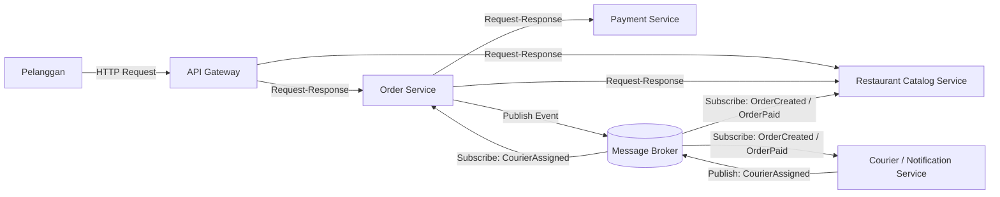
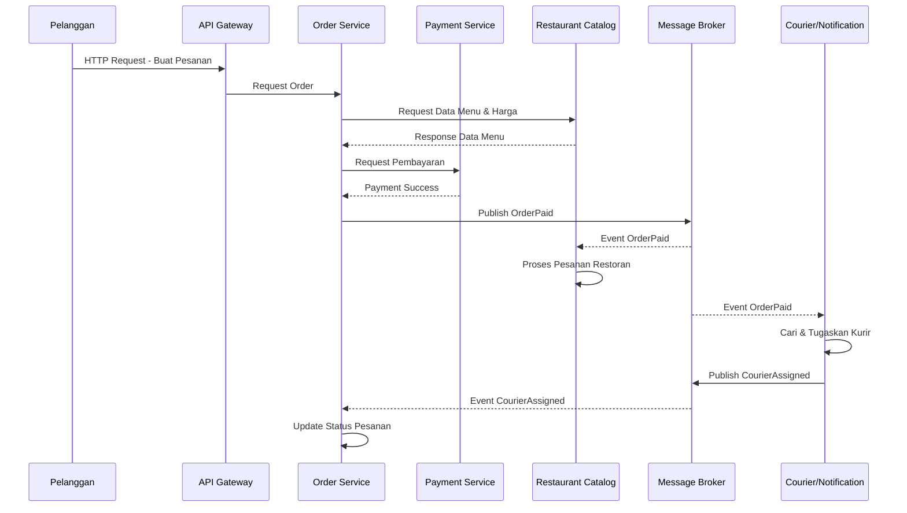

# Tugas 2 (Pekan 2) — Perancangan Arsitektur untuk FoodGo

## 1. Gaya Arsitektur yang Dipilih

Pada sistem FoodGo digunakan kombinasi **Service-Oriented Architecture (SOA)** dan **Publish-Subscribe**.

**SOA** digunakan untuk memisahkan fungsi utama FoodGo menjadi beberapa service yang dapat berjalan dan dikembangkan secara independen, yaitu:

* Order Service
* Payment Service
* Restaurant Catalog Service
* Courier/Notification Service

Sementara itu, **Publish-Subscribe** digunakan untuk komunikasi berbasis event antar-service. Event dikirim melalui **Message Broker**, sehingga service yang menghasilkan event tidak perlu mengetahui secara langsung service mana saja yang menerima event tersebut.

Kombinasi ini dipilih karena SOA membantu mengurangi ketergantungan antar-modul, sedangkan Publish-Subscribe membuat komunikasi antar-service menjadi lebih *loosely coupled*. Dengan demikian, perubahan atau deployment ulang pada salah satu service tidak harus menyebabkan seluruh sistem FoodGo ikut berhenti.

---

## 2. Komponen dan Interaksi

Komponen utama dalam arsitektur FoodGo adalah:

| Komponen                         | Fungsi                                                                               |
| -------------------------------- | ------------------------------------------------------------------------------------ |
| **API Gateway**                  | Menjadi pintu masuk request dari pelanggan dan meneruskannya ke service yang sesuai. |
| **Order Service**                | Membuat dan mengelola pesanan serta status pesanan.                                  |
| **Payment Service**              | Memproses pembayaran pelanggan.                                                      |
| **Restaurant Catalog Service**   | Mengelola data restoran, menu, harga, dan ketersediaan menu.                         |
| **Courier/Notification Service** | Mengelola penugasan kurir dan pengiriman notifikasi terkait pesanan.                 |
| **Message Broker**               | Menjadi perantara untuk mengirimkan event dari publisher kepada subscriber.          |

### Diagram Arsitektur



Berdasarkan diagram tersebut, komunikasi antara pelanggan dengan service dilakukan melalui API Gateway. Komunikasi untuk kebutuhan data yang harus segera mendapatkan respons menggunakan mekanisme **sinkron request-response**.

Sementara itu, informasi yang dapat diproses secara terpisah menggunakan mekanisme **asinkron berbasis event** melalui Message Broker.

---

## 3. Alur End-to-End

### Skenario: Pelanggan Membuat Pesanan hingga Kurir Ditugaskan

Alur lengkap sistem FoodGo adalah sebagai berikut.

### 1. Pelanggan membuat pesanan

Pelanggan memilih restoran dan menu kemudian mengirimkan pesanan melalui aplikasi.

```text
Pelanggan → API Gateway → Order Service
```

Komunikasi menggunakan **sinkron request-response melalui HTTP/API** karena sistem membutuhkan respons untuk mengetahui apakah request berhasil diterima.

### 2. Order Service mengecek katalog

Order Service meminta informasi menu, harga, dan ketersediaan dari Restaurant Catalog Service.

```text
Order Service → Restaurant Catalog Service
```

Komunikasi menggunakan **sinkron request-response** karena Order Service membutuhkan data tersebut sebelum melanjutkan proses pesanan.

### 3. Pembayaran diproses

Setelah data pesanan valid, Order Service meminta Payment Service memproses pembayaran.

```text
Order Service → Payment Service
```

Komunikasi menggunakan **sinkron request-response**.

Jika pembayaran berhasil:

```text
Payment Service → Order Service
```

Payment Service memberikan respons bahwa pembayaran berhasil.

### 4. Order Service menerbitkan event

Setelah pembayaran berhasil, Order Service menerbitkan event `OrderPaid` melalui Message Broker.

```text
Order Service → Message Broker
```

Komunikasi pada tahap ini bersifat **asinkron dan berbasis event**.

Contoh event:

```text
OrderPaid
- orderId
- restaurantId
- customerId
- items
- totalPayment
```

### 5. Restoran menerima event

Restaurant Service yang melakukan subscribe terhadap event `OrderPaid` menerima informasi pesanan melalui Message Broker.

```text
Message Broker → Restaurant Service
```

Restoran kemudian dapat mengetahui bahwa terdapat pesanan baru yang perlu diproses.

### 6. Courier Service menerima event

Courier/Notification Service juga melakukan subscribe terhadap event yang relevan.

```text
Message Broker → Courier/Notification Service
```

Service tersebut kemudian dapat melakukan proses pencarian dan penugasan kurir.

### 7. Kurir berhasil ditugaskan

Setelah kurir ditemukan, Courier Service menerbitkan event `CourierAssigned`.

```text
Courier Service → Message Broker
```

Kemudian Order Service yang melakukan subscribe terhadap event tersebut menerima informasi:

```text
Message Broker → Order Service
```

Status pesanan dapat diperbarui menjadi:

```text
Kurir Ditugaskan
```

---

## 4. Diagram Alur End-to-End



Pada diagram tersebut terdapat dua jenis komunikasi:

**Sinkron**

* Pelanggan → API Gateway
* API Gateway → Order Service
* Order Service → Restaurant Catalog
* Order Service → Payment Service

**Asinkron**

* Order Service → Message Broker
* Message Broker → Restaurant
* Message Broker → Courier
* Courier → Message Broker
