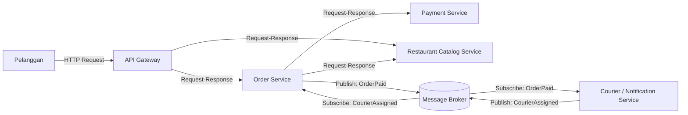

# Tugas 2 (Pekan 2) — Perancangan Arsitektur untuk FoodGo

## 1. Gaya Arsitektur yang Dipilih

Pada sistem FoodGo digunakan kombinasi **Service-Oriented Architecture (SOA)** dan **Publish-Subscribe**.

**SOA** digunakan untuk memisahkan fungsi utama FoodGo menjadi beberapa service yang dapat berjalan dan dikembangkan secara independen, yaitu:

* Order Service
* Payment Service
* Restaurant Catalog Service
* Courier/Notification Service

Sementara itu, **Publish-Subscribe** digunakan untuk komunikasi berbasis event antar-service. Event dikirim melalui **Message Broker**, sehingga service yang menghasilkan event tidak perlu mengetahui secara langsung service mana saja yang menerima event tersebut.

Kombinasi ini dipilih karena SOA membantu mengurangi ketergantungan antar-modul, sedangkan Publish-Subscribe membuat komunikasi antar-service menjadi lebih *loosely coupled*. Dengan demikian, perubahan atau deployment ulang pada salah satu service tidak harus menyebabkan seluruh sistem FoodGo ikut berhenti.

---

## 2. Komponen dan Interaksi

Komponen utama dalam arsitektur FoodGo adalah:

| Komponen                         | Fungsi                                                                               |
| -------------------------------- | ------------------------------------------------------------------------------------ |
| **API Gateway**                  | Menjadi pintu masuk request dari pelanggan dan meneruskannya ke service yang sesuai. |
| **Order Service**                | Membuat dan mengelola pesanan serta status pesanan.                                  |
| **Payment Service**              | Memproses pembayaran pelanggan.                                                      |
| **Restaurant Catalog Service**   | Mengelola data restoran, menu, harga, dan ketersediaan menu.                         |
| **Courier/Notification Service** | Mengelola penugasan kurir dan pengiriman notifikasi terkait pesanan.                 |
| **Message Broker**               | Menjadi perantara untuk mengirimkan event dari publisher kepada subscriber.          |

### Diagram Arsitektur



Berdasarkan diagram tersebut, pelanggan berkomunikasi dengan sistem melalui API Gateway. Request yang membutuhkan respons langsung diteruskan ke service terkait menggunakan komunikasi **sinkron request-response**. Contohnya, Order Service meminta data menu dan ketersediaan dari Restaurant Catalog Service atau meminta Payment Service memproses pembayaran.

Untuk komunikasi yang tidak membutuhkan respons langsung, Order Service dan Courier/Notification Service menggunakan **asinkron berbasis event** melalui Message Broker. Order Service menerbitkan event `OrderPaid` setelah pembayaran berhasil, kemudian Courier/Notification Service menerima event tersebut untuk memproses penugasan kurir. Setelah kurir berhasil ditugaskan, Courier/Notification Service menerbitkan event `CourierAssigned` yang kemudian diterima oleh Order Service untuk memperbarui status pesanan.

---

## 3. Alur End-to-End

### Skenario: Pelanggan Membuat Pesanan hingga Kurir Ditugaskan

Alur lengkap sistem FoodGo adalah sebagai berikut.

### 1. Pelanggan membuat pesanan

Pelanggan memilih restoran dan menu kemudian mengirimkan pesanan melalui aplikasi.

```text
Pelanggan → API Gateway → Order Service
```

Komunikasi menggunakan **sinkron request-response melalui HTTP/API** karena sistem membutuhkan respons untuk mengetahui apakah request berhasil diterima.

### 2. Order Service mengecek katalog

Order Service meminta informasi menu, harga, dan ketersediaan dari Restaurant Catalog Service.

```text
Order Service → Restaurant Catalog Service
```

Komunikasi menggunakan **sinkron request-response** karena Order Service membutuhkan data tersebut sebelum melanjutkan proses pesanan.

### 3. Pembayaran diproses

Setelah data pesanan valid, Order Service meminta Payment Service memproses pembayaran.

```text
Order Service → Payment Service
```

Komunikasi menggunakan **sinkron request-response**.

Jika pembayaran berhasil, Payment Service mengirimkan respons kepada Order Service.

```text
Payment Service → Order Service
```

Order Service kemudian mengetahui bahwa pembayaran untuk pesanan tersebut berhasil.

### 4. Order Service menerbitkan event

Setelah pembayaran berhasil, Order Service menerbitkan event `OrderPaid` melalui Message Broker.

```text
Order Service → Message Broker
```

Komunikasi pada tahap ini bersifat **asinkron dan berbasis event**.

Contoh data dalam event:

```text
OrderPaid
- orderId
- restaurantId
- customerId
- items
- totalPayment
```

### 5. Courier/Notification Service menerima event

Courier/Notification Service melakukan subscribe terhadap event `OrderPaid` melalui Message Broker.

```text
Message Broker → Courier/Notification Service
```

Setelah menerima event tersebut, Courier/Notification Service dapat memproses penugasan kurir untuk pesanan yang sudah dibayar.

### 6. Kurir ditugaskan

Setelah proses penugasan selesai, Courier/Notification Service menerbitkan event `CourierAssigned`.

```text
Courier/Notification Service → Message Broker
```

Komunikasi ini bersifat **asinkron dan berbasis event**.

### 7. Order Service memperbarui status pesanan

Order Service melakukan subscribe terhadap event `CourierAssigned` melalui Message Broker.

```text
Message Broker → Order Service
```

Setelah menerima event tersebut, Order Service memperbarui status pesanan menjadi:

```text
Kurir Ditugaskan
```

Dengan demikian, alur komunikasi dalam skenario ini terdiri dari komunikasi **sinkron** untuk proses yang membutuhkan respons langsung, seperti pengecekan katalog dan pembayaran, serta komunikasi **asinkron berbasis event** untuk proses setelah pembayaran, seperti penugasan kurir dan pembaruan status pesanan.

## 4. Analisis: Mengatasi Coupling dari tugas 1

Pada Tugas 1, FoodGo memiliki tiga masalah utama yang berkaitan dengan coupling, yaitu Latency is Zero, The Network is Reliable, dan Single Point of Failure. Pada Tugas 2, kombinasi SOA + Publish-Subscribe digunakan untuk mengurangi ketergantungan antar-modul dan menangani masalah tersebut.

| Aspek      |                    Sebelum                           |                          Sesudah                            |
| ---------- | ---------------------------------------------------- | ----------------------------------------------------------- |
| Struktur   | Semua modul berada dalam satu aplikasi               | Modul dipisahkan menjadi beberapa service                   |
| Coupling   | Tinggi                                               | Lebih rendah                                                |
| Komunikasi | Antar-modul dalam satu aplikasi                      | Sinkron dan asinkron melalui API dan Message Broker         |
| Deployment | Semua modul ikut di-deploy                           | Service dapat di-deploy secara terpisah                     |
| Kegagalan  | Satu server bermasalah dapat mengganggu banyak modul | Gangguan satu service tidak harus menghentikan service lain |
| Event      | Tidak menggunakan Message Broker                     | Menggunakan Publish-Subscribe                               |


Hubungan dengan Pitfall Tugas 1

1. Latency is Zero
Solusinya adalah menggunakan timeout pada komunikasi antar-service, terutama Order Service dengan Payment Service, serta retry terbatas untuk gangguan sementara.

2. The Network is Reliable
Solusinya adalah menggunakan timeout, retry, dan Message Broker agar kegagalan komunikasi dapat ditangani dan tidak selalu bergantung pada komunikasi langsung antar-service.

3. Single Point of Failure
Solusinya adalah memisahkan modul menjadi beberapa service sehingga tidak seluruh fungsi FoodGo bergantung pada satu server atau satu proses.

Trade-Off Arsitektur

Kombinasi SOA dan Publish-Subscribe juga memiliki beberapa trade-off:

Kompleksitas meningkat karena terdapat beberapa service dan Message Broker.
Debugging lebih sulit karena alur Publish-Subscribe tidak selalu linear.
Monitoring dan logging lebih diperlukan untuk melacak komunikasi antar-service.
Retry dapat menambah beban jika dilakukan terlalu sering.
Konsistensi data lebih kompleks karena komunikasi asinkron dapat menyebabkan data diterima dengan jeda waktu tertentu.
Kesimpulan Analisis

Kombinasi SOA + Publish-Subscribe dapat mengurangi coupling pada FoodGo dengan memisahkan modul menjadi beberapa service dan menggunakan komunikasi berbasis event. Arsitektur ini juga menerapkan solusi dari Tugas 1 melalui timeout dan retry untuk masalah latency serta jaringan, dan pemisahan service untuk mengatasi Single Point of Failure. Namun, konsekuensinya adalah sistem menjadi lebih kompleks dalam hal debugging, monitoring, dan pengelolaan komunikasi antar-service.
